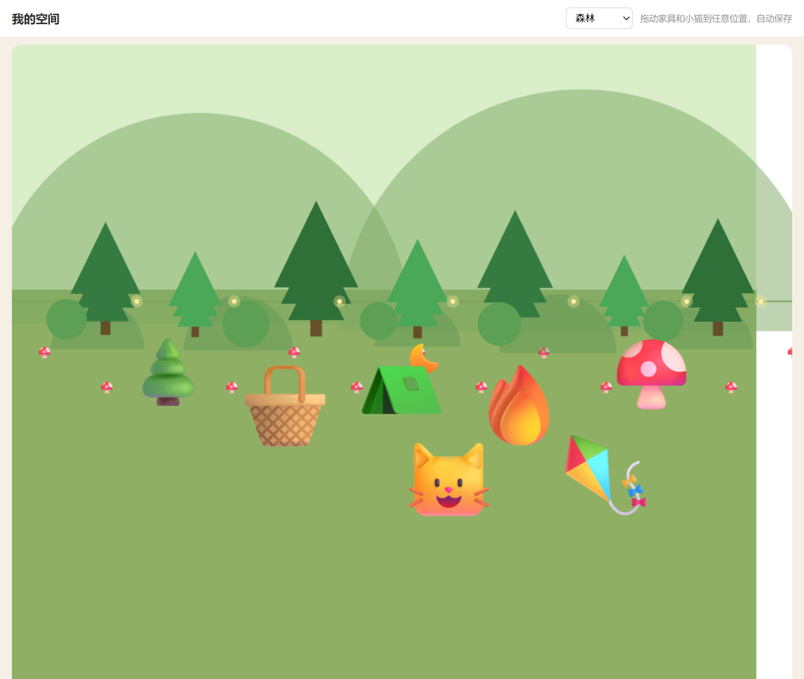

# Focus Pet 🐾

> 陪你学习、也监督你学习的桌面养成宠物。平时卖萌，你一摸鱼它就一点一点变生气，用分级阻断把你拉回学习。


## ✨ 特性

**监督与阻断**
- 活动窗口检测 + 浏览器扩展 URL 级黑白名单 + 「教宠物」误判纠正
- 本地截图画面分析（OCR/图案/颜色 + 机器学习分类器）兜底拦截，全程本地、不上传
- 情绪温度计逐级变生气（4 档），分级阻断：提醒 → 遮挡 → 提示关闭
- 学习计时、番茄钟、退出承诺锁、防绕过扣币扣好感

**桌宠体验（Electron HTML）**
- 透明置顶 + 鼠标穿透的 HTML 小猫：呼吸 / 眨眼 / 情绪 / 打盹 / 踱步 / 眼睛追踪
- 说话气泡（脑袋右侧、不遮脸、不两字换行）、双击摸头、投喂、每日打卡
- 右键菜单、系统托盘（退出=最小化到托盘）、开机自启、迷你模式、免打扰

**养成与空间**
- 专注币经济：学习赚币、投喂/购物花币、每日打卡连签奖励
- 奖章系统（每日/每周/每月）+ 成就徽章
- 我的空间：温馨小屋 / 星空田野 / 海边 / 森林 四张地图，家具自由摆放
- 商店：家具按地图分类（含露营系列）

**全部窗口 HTML 化**：设置 / 黑白名单 / 帮助中心 / 成就 / 学习报告 / 商店 / 我的空间

## 🖼 截图

| 我的空间（森林） | 桌宠 |
|---|---|
|  |  |

## ⬇️ 下载安装

- 从 [Releases](https://github.com/GITHUB_USERNAME/focus-pet/releases/latest) 下载 `FocusPet-Setup-4.0.4.exe`（约 166MB，Windows 安装包）
- 运行安装包：选择目录 → 安装 → 完成；开始菜单/桌面快捷方式启动
- 卸载：控制面板「程序和功能」或开始菜单里的卸载程序；卸载会保留你的学习数据
- 首次运行若出现 SmartScreen「未知发布者」，点「更多信息 → 仍要运行」即可

## 🚀 快速开始（源码运行）

```powershell
# 环境：Windows 10/11 + Python 3.10+（推荐用 uv 管理）
uv sync          # 或 pip install -r requirements.txt
uv run python main.py --headless-check   # 自检核心逻辑
uv run python main.py                     # 启动桌宠
```

启用浏览器扩展：先运行主程序，再在 Chrome/Edge「加载已解压的扩展程序」选择 `browser_extension` 文件夹。

## 🖥 系统要求

- Windows 10 / 11（64 位）
- Python 3.10+（源码运行）；直接安装包无需 Python

## 📦 项目结构

```
focus-pet/
├── main.py              # 入口：Electron 优先，失败回退 Tk
├── desktop/             # Electron 壳（透明+置顶+穿透+托盘）
├── ui/                  # HTML 桌宠 + 7 个 HTML 窗口 + Tk 回退版
├── core/                # 配置/规则/情绪/会话/经济/奖章/成就/皮肤
├── sensors/             # 窗口检测 / 截图画面分析
├── blockers/            # 分级阻断
├── bridge/              # 本地桥接（扩展 ↔ 主程序）
├── browser_extension/   # Chrome/Edge 扩展（MV3）
├── tools/               # 皮肤生成/主题脚手架/打包
└── docs/                # 设计文档 / 总结
```

## 📚 文档

- [设计文档](docs/设计文档.md)
- [GitHub 桌宠调研报告](docs/GitHub桌宠调研报告.md)

## 🔒 隐私

- 截图 / 窗口信息只在本地处理，**不保存、不上传**
- 浏览器扩展只连接本机 `127.0.0.1`
- 用户数据保存在 `%LOCALAPPDATA%\FocusPet`（卸载不删除）

## 📄 开源协议

[MIT](LICENSE)
