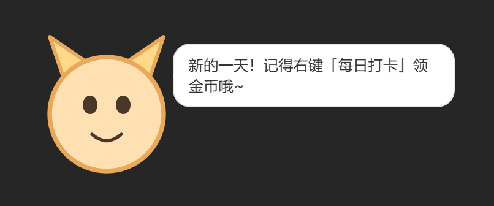
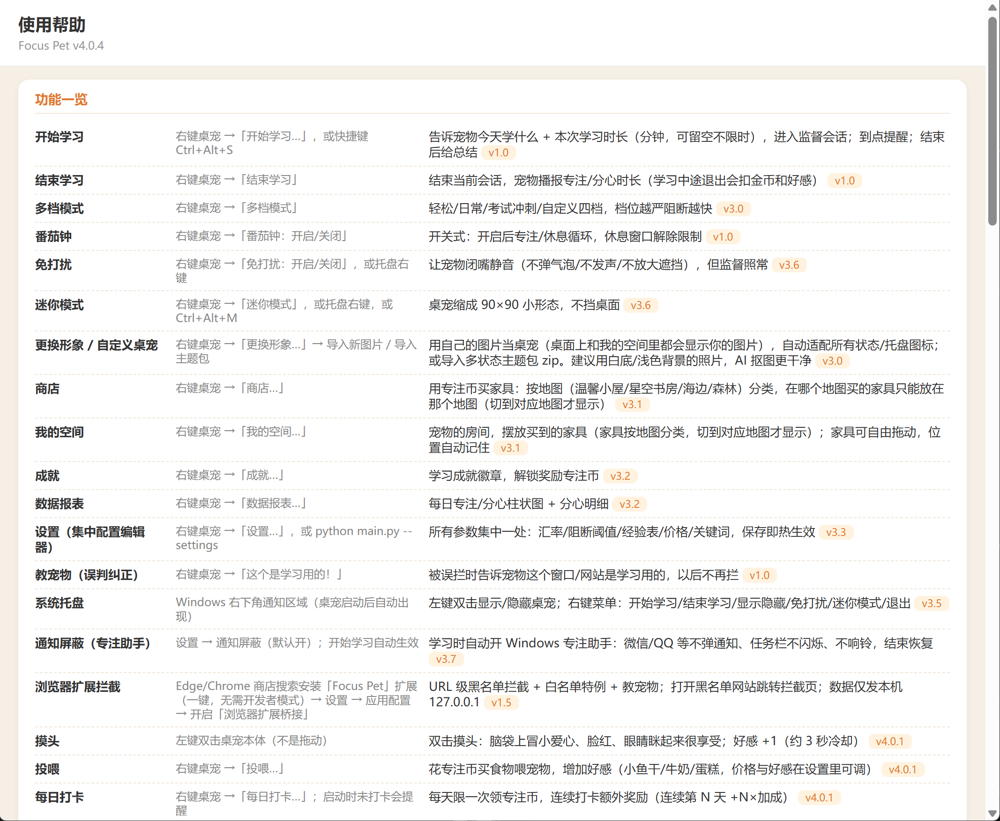
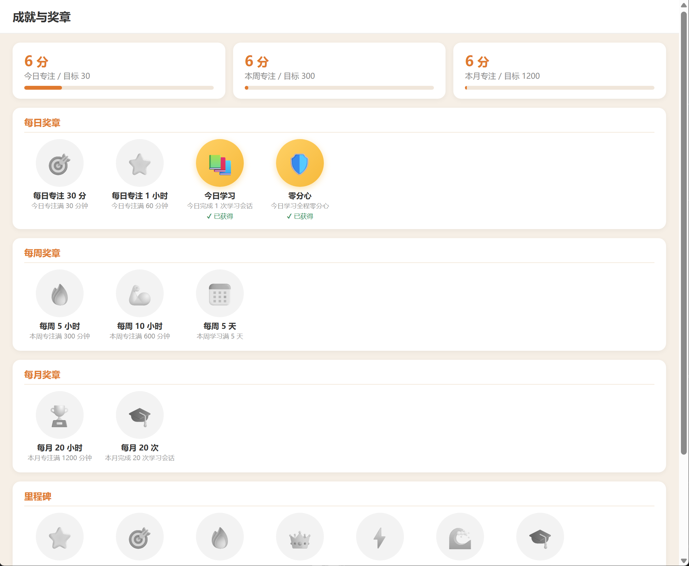
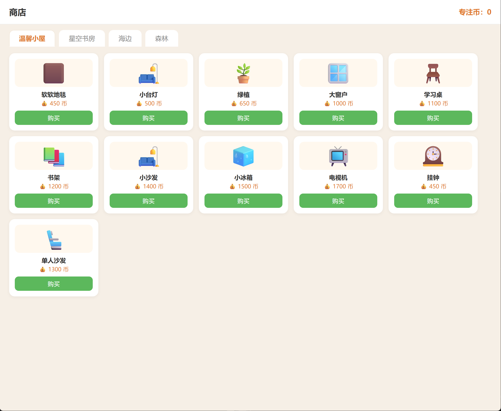
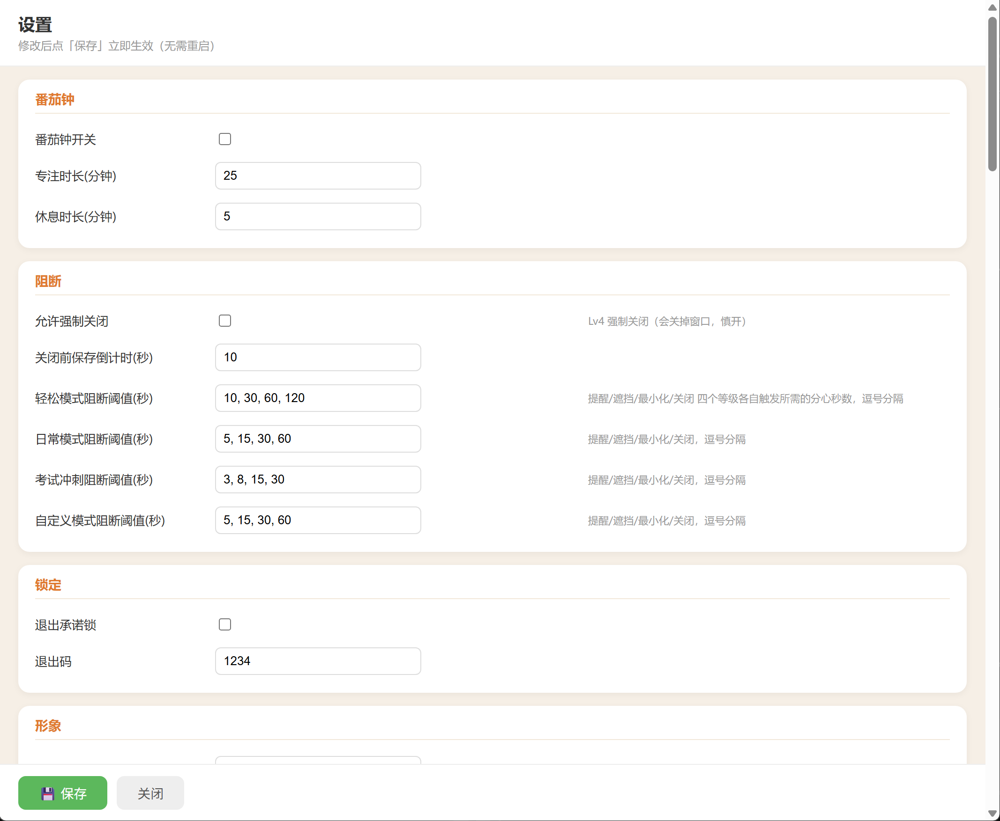
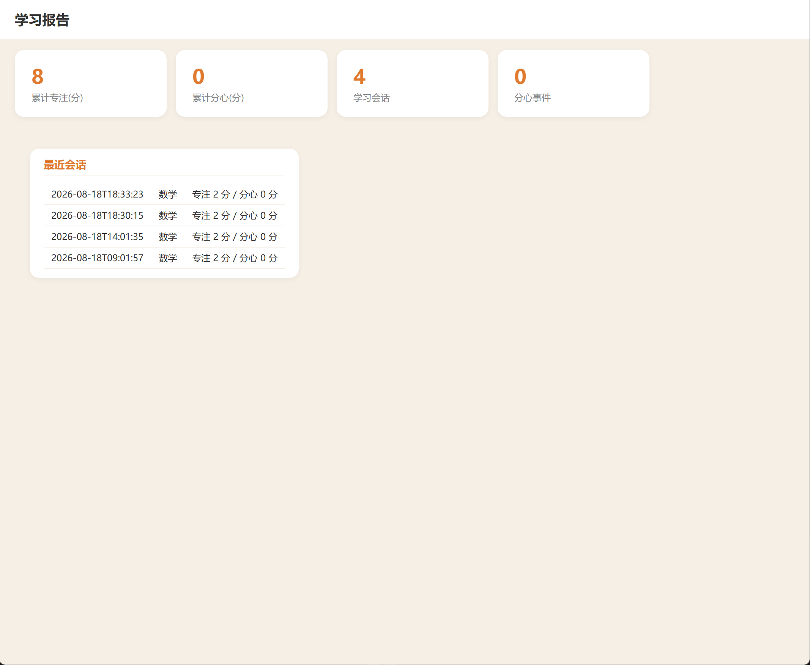

# Focus Pet 🐾

> A desktop companion pet that keeps you focused — and keeps an eye on you. It acts cute while you study;
> the moment you slack off, it gets visibly annoyed and uses staged blocking to pull you back to work.



## ✨ Features

**Supervision & Blocking**
- Active-window detection + browser-extension URL blacklist/whitelist + “teach the pet” to correct false positives
- Local screenshot analysis (OCR / layout / color + ML classifier) as a fallback — **everything stays on-device, nothing is uploaded**
- Emotion thermometer escalates through 4 anger levels; staged blocking: remind → overlay → prompt to close
- Study timer, Pomodoro, exit-commitment lock, anti-bypass coin/affinity penalties

**The Pet (Electron HTML)**
- Transparent, always-on-top, click-through HTML cat: breathing / blinking / moods / dozing / pacing / eye tracking
- Speech bubble (right of the head, never covers the face, no awkward 2-char wraps), double-click to pet, feeding, daily check-in
- Right-click menu, system tray (closing the window = minimize to tray), start on boot, mini mode, do-not-disturb

**Raising & Space**
- Focus-coin economy: earn while studying, spend on feeding/shopping, daily check-in streaks
- Medal system (daily / weekly / monthly) + achievement badges
- My Space: Cozy Room / Star Field / Seaside / Forest maps with freely placeable furniture
- Shop: furniture grouped by map (including a camping series)

**All windows are HTML** — Settings / Rules / Help / Achievements / Report / Shop / My Space

## 🖼 Screenshots

| Help | Achievements | Shop |
|---|---|---|
|  |  |  |

| Settings | Report | The Pet |
|---|---|---|
|  |  |  |

## ⬇️ Download & Install

- Grab **`FocusPet-Setup-4.0.4.exe`** (~166 MB, Windows installer) from the [Releases page](https://github.com/GITHUB_USERNAME/focus-pet/releases/latest)
- Run the installer: pick a directory → install → done; launch from the Start Menu or desktop shortcut
- Uninstall via **Settings → Apps**, or the uninstaller in the Start Menu — **your study data is kept**
- If SmartScreen shows “Unknown publisher” on first run, click **More info → Run anyway**

## 🚀 Quick Start (from source)

```powershell
# Windows 10/11 + Python 3.10+ (uv recommended)
uv sync                      # or: pip install -r requirements.txt
uv run python main.py --headless-check   # sanity-check core logic
uv run python main.py                     # launch the pet
```

Browser extension: start the app, then in Chrome/Edge choose **Load unpacked** and select the `browser_extension` folder.

## 🖥 System Requirements

- Windows 10 / 11 (64-bit)
- Python 3.10+ only needed for running from source; the installer needs no Python

## 📦 Project Structure

```
focus-pet/
├── main.py              # Entry point: Electron first, falls back to Tk
├── desktop/             # Electron shell (transparent + topmost + click-through + tray)
├── ui/                  # HTML pet + 7 HTML windows + Tk fallback
├── core/                # config / rules / emotion / sessions / economy / medals / achievements / skins
├── sensors/             # window detection / screenshot analysis
├── blockers/            # staged blocking
├── bridge/              # local bridge (extension <-> main app)
├── browser_extension/   # Chrome/Edge extension (MV3)
├── tools/               # skin tools / theme scaffold / packaging
└── docs/                # design docs
```

## 📚 Documentation

- [Design doc](docs/设计文档.md)

## 🔒 Privacy

- Screenshots / window info are processed **locally only** — never saved, never uploaded
- The browser extension only talks to `127.0.0.1`
- User data lives in `%LOCALAPPDATA%\FocusPet` and is kept on uninstall

## 📄 License

[MIT](LICENSE)
